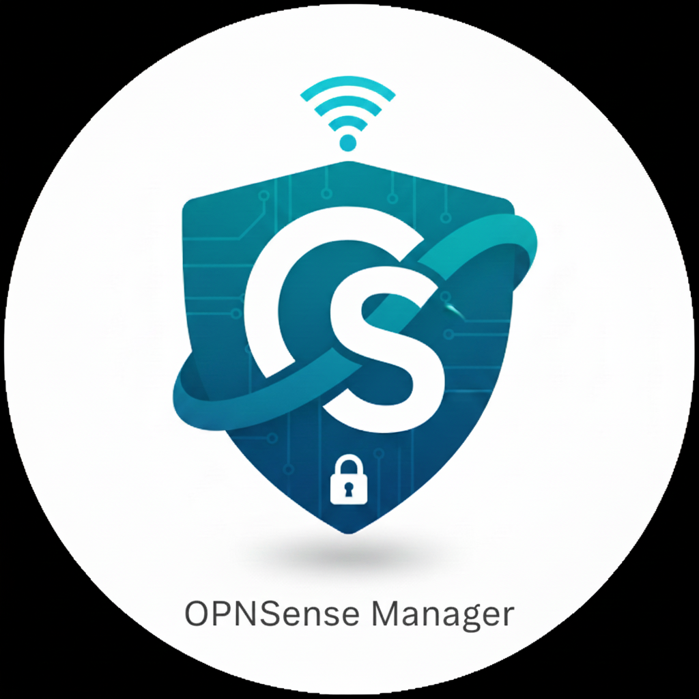
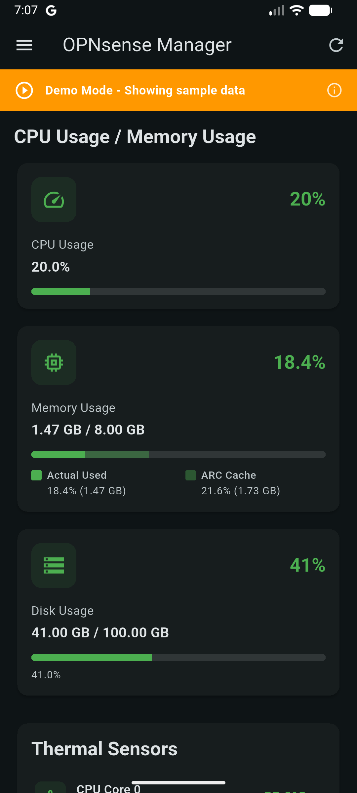
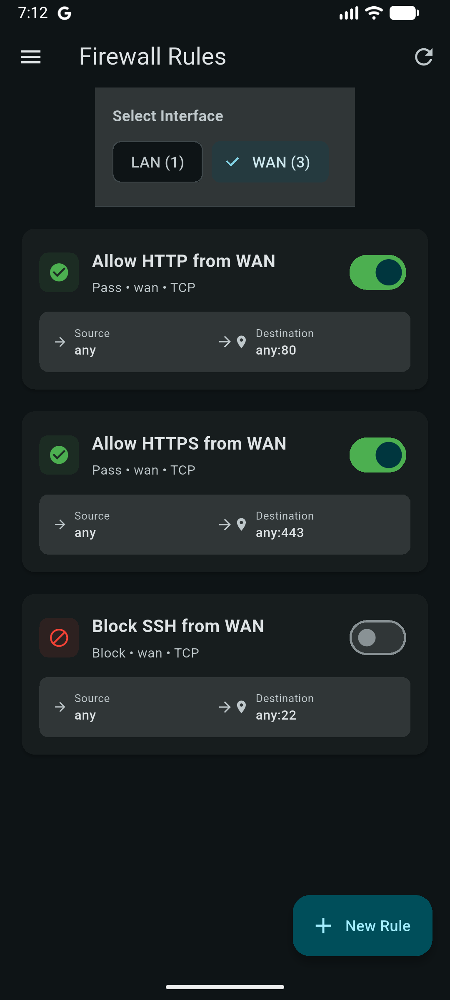
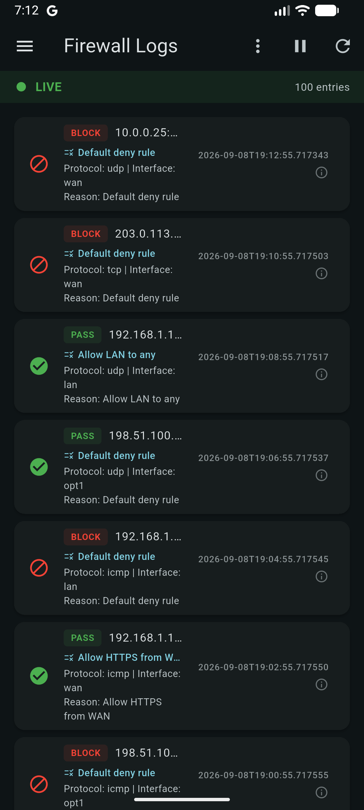
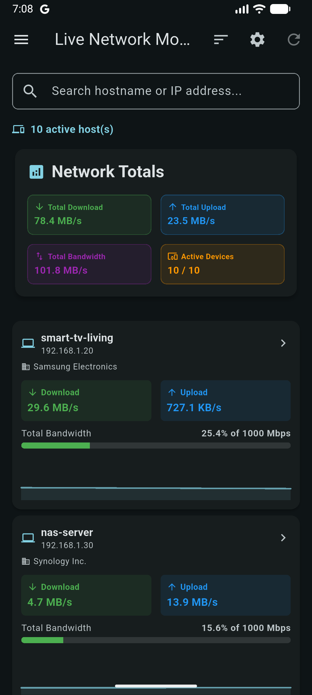
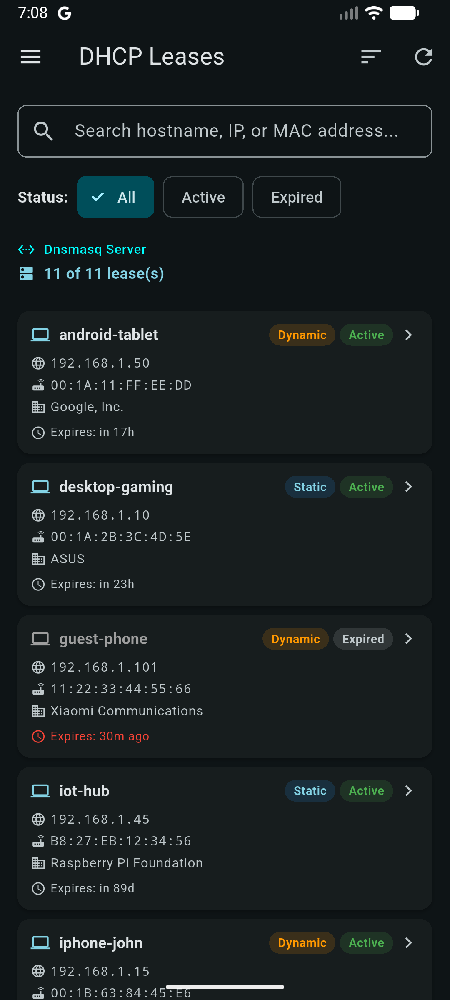
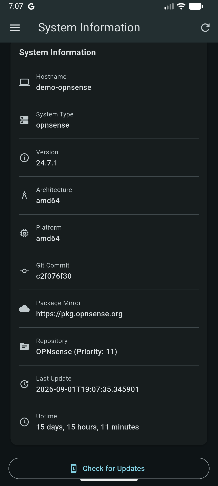
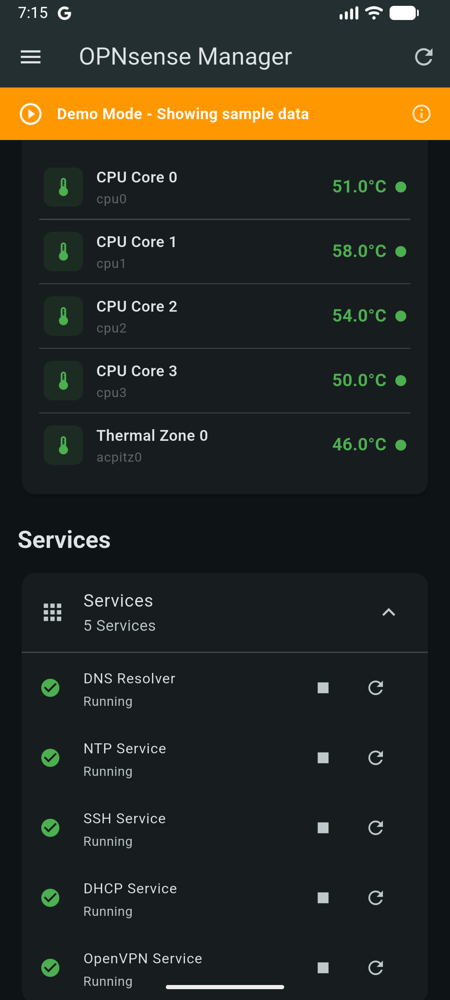
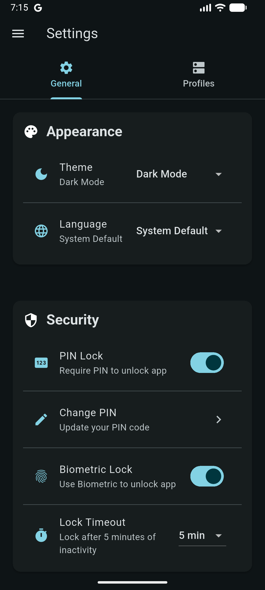

<a id="readme-top"></a>

<div align="center">

[![Contributors][contributors-shield]][contributors-url]
[![Forks][forks-shield]][forks-url]
[![Stargazers][stars-shield]][stars-url]
[![Issues][issues-shield]][issues-url]

</div>

<br />
<div align="center">
  <a href="https://github.com/Etregin/OPNsense_Manager">
    
  </a>

  <h3 align="center">OPNsense Manager</h3>

## ❤️ Support the Project

If you find this project useful, consider supporting its development:

### 💰 Crypto Donations

#### USDT / USDC (BEP20, BSC, ERC20, BASE, POL, ARBITRUM, AVAXC) : 

```
0xe0b9015117a4a69131481c2e9c1553dde839df18
```


#### Also Binance Gift cards can work by sending it to the email etreginwow@gmail.com


## 📱 Get the App


<p align="center" style="line-height:0; margin:0; padding:0;">
  <a href="https://play.google.com/store/apps/details?id=com.dt.opnsense_manager" target="_blank" style="text-decoration:none; border:none; outline:none;"></a>
  <a href="https://apps.apple.com/us/app/opnsense-manager/id6767634059" target="_blank" style="text-decoration:none; border:none; outline:none;"></a>
  <a href="https://f-droid.org/en/packages/com.dt.opnsense_manager/" target="_blank" style="text-decoration:none; border:none; outline:none;"></a>
</p>

</div>

<!-- TABLE OF CONTENTS -->
<details>
  <summary>Table of Contents</summary>
  <ol>
    <li>
      <a href="#about-the-project">📖 About The Project</a>
    </li>
    <li>
      <a href="#getting-started">🚀 Getting Started</a>
      <ul>
        <li><a href="#requirements">📋 Requirements</a></li>
        <li><a href="#configure-opnsense-api">🔧 Configure OPNsense API</a></li>
        <li><a href="#installation">📥 Installation</a></li>
      </ul>
    </li>
    <li><a href="#features">✨ Features</a></li>
    <ul>
        <li><a href="#authentication-security">🔐 Authentication & Security</a></li>
        <li><a href="#dashboard">📊 Dashboard</a></li>
        <li><a href="#firewall-management">🔥 Firewall Management (Currently only works with "Firewall > Automation > Filter" rules)</a></li>
        <li><a href="#firewall-logs">📋 Firewall Logs</a></li>
        <li><a href="#live-network-monitoring">🌐 Live Network Monitoring</a></li>
        <li><a href="#dhcp-leases">📡 DHCP Lease Management</a></li>
        <li><a href="#system-info">ℹ️ System Information</a></li>
        <li><a href="#service-management">🔧 Service Management</a></li>
        <li><a href="#settings">⚙️ Settings</a></li>
        <li><a href="#additional-features">🔄 Additional Features</a></li>
      </ul>
    <li><a href="#security-considerations">🛡️ Security Considerations</a></li>
    <li><a href="#architecture">🏗️ Architecture</a></li>
    <li><a href="#roadmap">🗺️ Roadmap</a></li>
    <li><a href="#contributing">🤝 Contributing</a></li>
    <li><a href="#troubleshooting">🐛 Troubleshooting</a></li>
    <li><a href="#license">📄 License</a></li>
    <li><a href="#getting-help">💬 Getting Help</a></li>
    <li><a href="#acknowledgments">🙏 Acknowledgments</a></li>
  </ol>
</details>


<a id="about-the-project"></a>
## 📖 About The Project

OPNsense is a professional Flutter mobile application for managing OPNsense firewall routers. Monitor system status, manage firewall rules, view logs, control services, and manage your network security from your mobile device.

I could not find an mobile application that can do what I needed so I decided to create my own and share it with the community.

[](https://flutter.dev)
[](https://dart.dev)
[](LICENSE)
[](https://flutter.dev/multi-platform)

<p align="right">(<a href="#readme-top">back to top</a>)</p>


<a id="getting-started"></a>
## 🚀 Getting Started

<a id="requirements"></a>
### 📋 Requirements

- **Android**: API 21 (Android 5.0) or higher
- **iOS**: iOS 12.0 or higher
- **OPNsense**: Version 20.7 or higher with API access enabled

<a id="configure-opnsense-api"></a>
### 🔧 Configure OPNsense API

On your OPNsense firewall:
1. Go to **System → Access → Users**
2. Create a new user or edit existing
3. Generate API credentials (Key + Secret)
4. Configure user permissions using **one of these methods**:

#### Option 1: Admin Group (Recommended - Simplest)
- Add the API user to the **"admins"** group under **Group Membership**
- This grants full access to all features in both the OPNsense web interface and the mobile app
- ✅ Best for users who want complete management capabilities
- ✅ No permission configuration needed
- ✅ Works across all OPNsense versions

#### Option 2: Custom Permissions (Advanced)
Configure individual permissions based on what you want to access. The app requires the same permissions as the OPNsense web interface:

**Important**: If you can access a feature in the OPNsense web GUI with your API user, the mobile app will also be able to access it. If you cannot access it in the web GUI, the app won't be able to access it either.

> **💡 Tip**: To verify permissions are working, log in to the OPNsense web interface with your API user credentials. Any page you can access in the web GUI will also work in the mobile app. Any page you cannot access will return a 403 error in the app.

> **⚠️ Note**: After changing permissions, you must log out and log back in to OPNsense for changes to take effect. Also restart the mobile app completely.

<a id="installation"></a>
### 📥 Installation

#### Option 1: Download Pre-built APK (Android)
1. Go to the [Releases](https://github.com/Etregin/OPNsense_Manager/releases) page
2. Download the latest APK file
3. Install on your Android device
4. Grant necessary permissions when prompted

#### Option 2: Build from Source
See [CONTRIBUTING.md](CONTRIBUTING.md) for detailed build instructions.

<p align="right">(<a href="#readme-top">back to top</a>)</p>


<a id="features"></a>
## ✨ Features

<a id="authentication-security"></a>
### 🔐 Authentication & Security
- **Secure API Authentication**: API key/secret based authentication with encrypted storage
- **Multiple Profile Management**: Manage multiple OPNsense instances seamlessly
- **PIN Lock**: Secure app access with 4-6 digit PIN code
- **Biometric Authentication**: Face ID, Touch ID, or Fingerprint support
- **Auto-Lock**: Configurable session timeout with automatic locking
- **Secure Storage**: Platform-specific encrypted credential storage (Keychain/Keystore)

<a id="dashboard"></a>
### 📊 Dashboard
- **System Overview**: Real-time display of hostname, version, and platform information
- **Resource Monitoring**: Live CPU and memory usage with visual indicators
- **Service Management**: View, start, stop, and restart system services with confirmation dialogs
- **Gateway Status**: Monitor gateway health and connectivity
- **System Uptime**: Formatted uptime display
- **Quick Navigation**: Easy access to all features from the main screen
- **Pull-to-Refresh**: Update data with a simple swipe gesture
- **Auto-Refresh**: Configurable automatic data updates


<a id="firewall-management"></a>
### 🔥 Firewall Management (Currently only works with "Firewall > Automation > Filter" rules)
- **View Rules**: List all firewall rules with detailed information and status
- **Create Rules**: Add new firewall rules with comprehensive configuration options
- **Edit Rules**: Modify existing rules with full parameter control
- **Delete Rules**: Remove unwanted rules with confirmation dialogs
- **Toggle Rules**: Enable/disable rules with a single tap
- **Rule Details**: View complete rule configuration including:
  - Action (Pass/Block/Reject)
  - Interface (WAN/LAN/OPT, etc.)
  - Protocol (TCP/UDP/ICMP/Any)
  - Source and destination addresses with CIDR notation
  - Port specifications and ranges
  - Rule descriptions and labels
  - Creation and modification timestamps
  

<a id="firewall-logs"></a>
### 📋 Firewall Logs
- **Real-time Logs**: View firewall activity as it happens
- **Filter by Action**: Show only Pass, Block, or Reject events
- **Search Functionality**: Find specific log entries quickly
- **Detailed Information**: View packet details including:
  - Source and destination IP addresses
  - Source and destination ports
  - Protocol information
  - Timestamps with timezone
  - Rule IDs and actions
  - Interface information
- **Auto-Refresh**: Configurable automatic log updates (5-60 seconds)
- **Log Limit**: Adjustable number of log entries displayed

<a id="live-network-monitoring"></a>
### 🌐 Live Network Monitoring
- **Real-time Network Activity**: Monitor active connections and network traffic in real-time
- **Device Discovery**: View all devices currently connected to your network
- **Connection Details**: See detailed information about each connection including:
  - Source and destination IP addresses
  - Ports and protocols
  - Connection state and duration
  - Data transfer rates
- **Device Blocking**: Quickly block devices directly from the network monitor
- **Auto-Refresh**: Configurable automatic updates to track network changes
- **Search & Filter**: Find specific devices or connections quickly


<a id="dhcp-leases"></a>
### 📡 DHCP Lease Management
- **Active Leases**: View all current DHCP leases on your network
- **Lease Details**: Complete information for each lease including:
  - IP address assignments
  - MAC addresses
  - Hostnames
  - Lease start and end times
  - Interface information
- **Device Blocking**: Block devices directly from the DHCP leases view
- **Search Functionality**: Quickly find specific devices by IP, MAC, or hostname
- **Pull-to-Refresh**: Update lease information on demand



<a id="system-info"></a>
### ℹ️ System Information
- **Firmware Details**: 
  - System type (OPNsense)
  - Version number
  - Architecture (amd64, etc.)
  - Git commit hash
  - Package mirror URL
  - Repository information with priority
  - Last update timestamp
- **System Status**:
  - Hostname
  - Platform (FreeBSD version)
  - System uptime
- **Pull-to-Refresh**: Update system information on demand


<a id="service-management"></a>
### 🔧 Service Management
- **Service Control**: Start, stop, and restart system services
- **Service Status**: Real-time service status indicators
- **Confirmation Dialogs**: Prevent accidental service disruptions
- **Visual Feedback**: Color-coded status indicators (running/stopped)
- **Service List**: View all available system services


<a id="settings"></a>
### ⚙️ Settings
- **Theme Control**: Toggle between light and dark modes
- **PIN Lock Configuration**: Set up and change PIN code
- **Biometric Setup**: Enable/disable biometric authentication
- **Session Timeout**: Configure auto-lock duration (1-60 minutes)
- **Profile Management**: 
  - Add new OPNsense profiles
  - Edit existing profiles
  - Delete profiles with confirmation
  - Switch between profiles instantly
  - Profile-specific credentials
- **App Lock**: Manually lock the app for security
- **About Screen**: View app information, version, and licenses


<a id="additional-features"></a>
### 🔄 Additional Features
- **Firewall Reboot**: Remotely reboot your OPNsense firewall with confirmation
- **Profile Switching**: Quickly change between different OPNsense instances
- **Connection Testing**: Verify API connectivity before saving profiles
- **Error Handling**: Comprehensive error messages and recovery options
- **Offline Support**: Graceful handling of network issues
- **Material Design 3**: Modern, beautiful UI following Material Design guidelines
- **Responsive Layout**: Optimized for various screen sizes


<p align="right">(<a href="#readme-top">back to top</a>)</p>


<a id="security-considerations"></a>
## 🛡️ Security Considerations

- ✅ API credentials stored using platform-specific secure storage (Keychain/Keystore)
- ✅ HTTPS enforced for all API communications
- ✅ Self-signed certificate support (configurable per profile)
- ✅ PIN lock with biometric authentication
- ✅ Auto-lock on app background
- ✅ No credentials logged or exposed in production
- ✅ Confirmation dialogs for destructive actions
- ✅ Session timeout for automatic security
- ⚠️ Certificate pinning not implemented (consider for production environments)

<p align="right">(<a href="#readme-top">back to top</a>)</p>


<a id="roadmap"></a>
## 🗺️ Roadmap
- [ ] Get Firewall rules to work with ALL rules
- [x] **VPN connection management** (OpenVPN, Tailscale, WireGuard)
- [ ] Push notifications for system alerts
- [ ] Backup/restore configuration functionality
- [ ] Package management interface
- [x] **Multi-language support (i18n)** - Supports English, Arabic, Spanish, French, and German with easy extensibility for more languages
- [ ] Tablet-optimized layouts
- [ ] Traffic monitoring with detailed charts
- [ ] Bandwidth quota management
- [ ] Interface statistics and graphs
- [x] **DHCP lease management** - View active leases and block devices
- [x] **Live network monitoring** - Real-time network activity monitoring with device blocking capability
- [ ] DNS configuration
- [ ] Certificate management
- [ ] User management interface
- [ ] Scheduled tasks/cron jobs
- [ ] Plugin management
- [x] **Export/import profiles** - Export and import connection profiles as JSON files

See the [open issues](issues-url) for a full list of proposed features (and known issues).

<p align="right">(<a href="#readme-top">back to top</a>)</p>


<a id="architecture"></a>
## 🏗️ Architecture

This project follows modern Flutter best practices with a clean, maintainable architecture:

### MVVM Pattern
- **Models**: Data classes with JSON serialization (`lib/models/`)
- **Views**: UI components and screens (`lib/screens/`, `lib/widgets/`)
- **ViewModels**: Business logic and state management (`lib/viewmodels/`)

### Key Features
- ✅ **Modular Design**: Reusable components and services
- ✅ **Separation of Concerns**: Clear boundaries between UI and business logic
- ✅ **Base Classes**: `BaseFormViewModel` and `BaseListViewModel` for consistency
- ✅ **Service Layer**: Organized services following Single Responsibility Principle
- ✅ **Widget Components**: 42+ reusable UI components
- ✅ **Type Safety**: Full Dart null-safety support

### Project Structure
```
lib/
├── models/           # Data models with JSON serialization
├── screens/          # Main screen widgets
├── viewmodels/       # Business logic and state management
│   └── base/        # Base ViewModel classes
├── widgets/          # Reusable UI components
│   ├── common/      # Shared widgets
│   ├── login/       # Login-specific widgets
│   ├── dashboard/   # Dashboard widgets
│   ├── firewall/    # Firewall management widgets
│   ├── settings/    # Settings widgets
│   ├── tailscale/   # Tailscale widgets
│   ├── vpn/         # VPN widgets
│   └── wireguard/   # WireGuard widgets
├── services/         # API and business services
│   ├── base/        # Base service classes
│   ├── demo/        # Demo mode services
│   ├── firewall/    # Firewall services
│   ├── network/     # Network services
│   ├── profile/     # Profile management
│   ├── settings/    # Settings services
│   ├── system/      # System services
│   └── vpn/         # VPN services
└── utils/           # Utility functions and validators
```

### Code Quality
- **Static Analysis**: 0 issues with `flutter analyze`
- **Code Reduction**: ~2,827 lines reduced through refactoring
- **Maintainability**: Average file size reduced from ~350 to ~250 lines
- **Documentation**: Comprehensive inline documentation

For detailed information about the architecture and refactoring process, see [REFACTORING_SUMMARY.md](REFACTORING_SUMMARY.md).

<p align="right">(<a href="#readme-top">back to top</a>)</p>


<a id="contributing"></a>
## 🤝 Contributing

Contributions are what make the open source community such an amazing place to learn, inspire, and create. Any contributions you make are **greatly appreciated**.

If you have a suggestion that would make this better, please fork the repo and create a pull request. You can also simply open an issue with the tag "enhancement". 

Review [CONTRIBUTING.md](CONTRIBUTING.md) for ways to get started.

Don't forget to give the project a star! Thanks again!

### ➕ Adding a Feature

1. **Fork the repository**
2. **Create a feature branch**: `git checkout -b feature/amazing-feature`
3. **Follow the code style**: Use `flutter analyze` and fix any issues
4. **Write meaningful commit messages**
5. **Test your changes** thoroughly on both Android and iOS if possible
6. **Update documentation** if needed
7. **Submit a pull request** with a clear description of changes

### 🐞 Reporting a Bug

**Check existing issues** to avoid duplicates, **Use the issue template** when creating new issues and **Provide detailed information**:

- App version
- Device and OS version
- OPNsense version
- Steps to reproduce
- Expected vs actual behavior
- Screenshots if applicable
- Error messages or logs


<p align="right">(<a href="#readme-top">back to top</a>)</p>

<a id="troubleshooting"></a>
## 🐛 Troubleshooting

### API Connection Issues
- Verify OPNsense API is enabled in System → Settings → Administration
- Check firewall rules allow connections from mobile device IP
- Confirm API key/secret are correct and not expired
- Test HTTPS certificate (allow self-signed certificates in profile settings)
- Verify API user has required permissions

### Biometric Authentication Not Working
- Ensure device has biometric hardware (fingerprint sensor, Face ID, etc.)
- Check app permissions are granted in device settings
- Verify biometric is enrolled on device
- Try disabling and re-enabling biometric in app settings

### Service Control Not Working
- Verify API user has System: Status permissions
- Check service names match OPNsense service IDs
- Ensure services are installed and available on your OPNsense instance

<p align="right">(<a href="#readme-top">back to top</a>)</p>

<a id="license"></a>
## 📄 License

This project is licensed under the GNU General Public License v3.0 - see the [LICENSE](LICENSE) file for details.

### ❓ Why GPLv3?

We chose GPLv3 to ensure that:
- The software remains free and open source
- Any modifications or derivatives must also be open source
- Users have the freedom to use, study, share, and modify the software
- The community benefits from improvements and contributions

<p align="right">(<a href="#readme-top">back to top</a>)</p>


<a id="getting-help"></a>
## 💬 Getting Help

- **Issues**: [GitHub Issues](https://github.com/Etregin/OPNsense_Manager/issues)
- **Discussions**: [GitHub Discussions](https://github.com/Etregin/OPNsense_Manager/discussions)
- **Email**: Etreginwow@gmail.com

### 🔒 Reporting Security Issues

If you discover a security vulnerability, please email Etreginwow@gmail.com instead of using the issue tracker.

<p align="right">(<a href="#readme-top">back to top</a>)</p>


<a id="acknowledgments"></a>
## 🙏 Acknowledgments

- OPNsense team for the excellent firewall platform

<p align="right">(<a href="#readme-top">back to top</a>)</p>


<!-- GitHub Badges -->
[contributors-shield]: https://img.shields.io/github/contributors/Etregin/OPNsense_Manager.svg?style=for-the-badge&color=green
[contributors-url]: https://github.com/Etregin/OPNsense_Manager/graphs/contributors

[forks-shield]: https://img.shields.io/github/forks/Etregin/OPNsense_Manager.svg?style=for-the-badge&color=blue
[forks-url]: https://github.com/Etregin/OPNsense_Manager/network/members

[stars-shield]: https://img.shields.io/github/stars/Etregin/OPNsense_Manager.svg?style=for-the-badge&color=yellow
[stars-url]: https://github.com/Etregin/OPNsense_Manager/stargazers

[issues-shield]: https://img.shields.io/github/issues/Etregin/OPNsense_Manager.svg?style=for-the-badge&color=red
[issues-url]: https://github.com/Etregin/OPNsense_Manager/issues

[license-shield]: https://img.shields.io/badge/License-GPLv3-blue
[license-url]: https://github.com/Etregin/OPNsense_Manager/blob/main/LICENSE
